<div align="center">

# EVC — Music & Video Streaming App

**A two-sided streaming app built in Flutter from a 39-screen design set.**

Listeners stream, own, rent and gift titles. Creators publish and monetise their own work — in the same app.

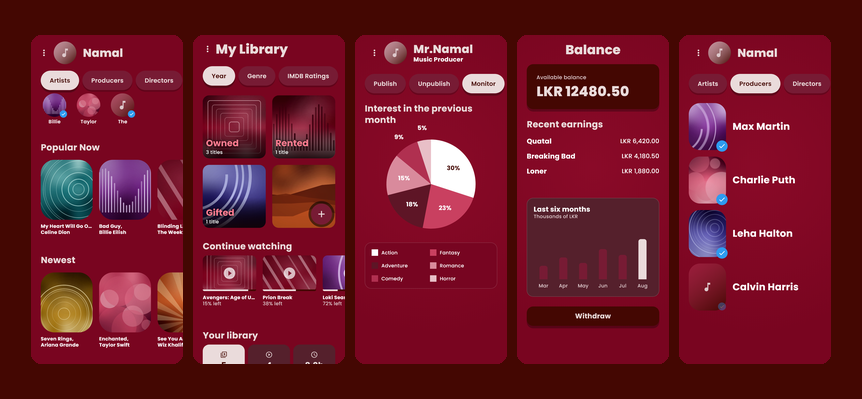


</div>

---

## What it does

**Consumer side** — onboarding, auth, a home feed of artists and rails, video
discovery with live search, a detail page where you can **own** or **rent** a
title, a player with cast/overview/episodes, a music player with real audio,
and a library split into Owned / Rented / Gifted.

**Creator side** — a producer studio with Publish / Unpublish / Monitor, an
upload flow, an audience-interest chart, per-title analytics and an earnings
balance.

State flows through the whole thing. Rent a title on the detail screen and the
library counts, the category lists and the detail screen all update together.
Publish a video in the studio and it appears in My Videos and Analytics.

## Highlights

- **26 screens**, both sides of the marketplace
- **Design system first** — 20 shared components driven by one token file
- **Real playback** — `just_audio` for music, `video_player` for video, with
  explicit loading and failure states
- **53 tests** — golden renders of every screen, behaviour coverage of the
  state layer, and an accessibility audit against Flutter's WCAG guidelines
- **Repository pattern** over mock data — swap in a real API without touching
  a single screen

## Screens

### Onboarding & auth

| Splash | Onboarding | Sign in | Interests |
|:--:|:--:|:--:|:--:|
| 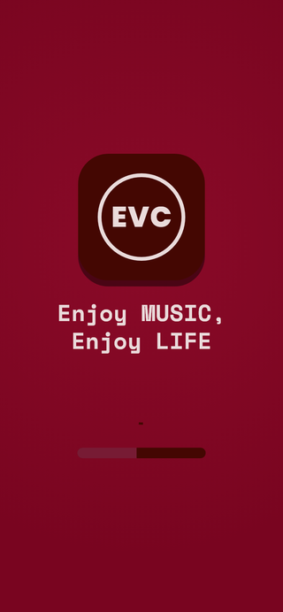 | 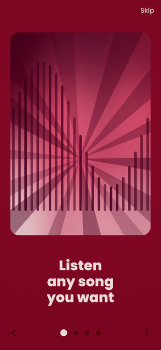 |  | 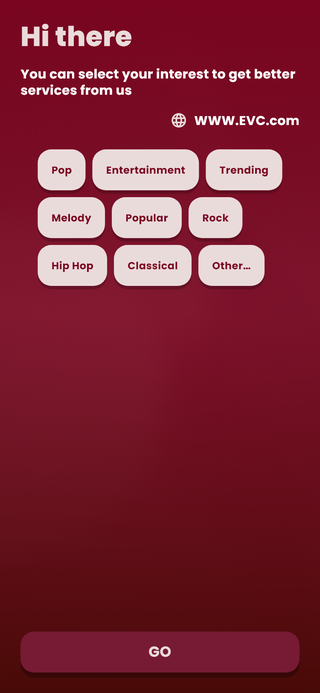 |

### Consumer

| Home | Discovery | Detail | Player |
|:--:|:--:|:--:|:--:|
| 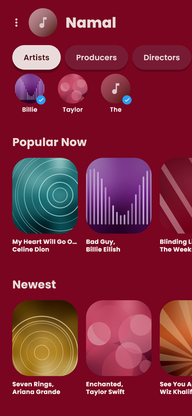 | 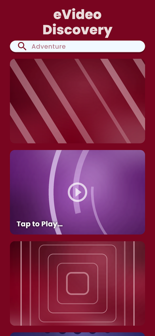 | 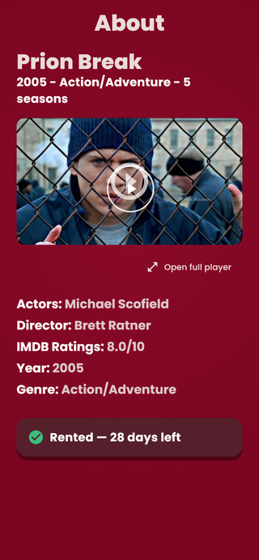 | 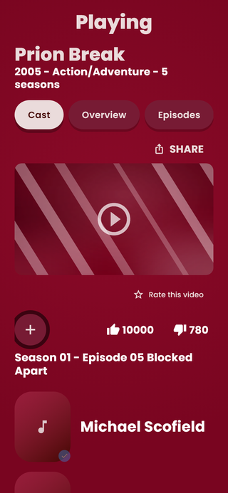 |

| Library | Music | People | Settings |
|:--:|:--:|:--:|:--:|
| 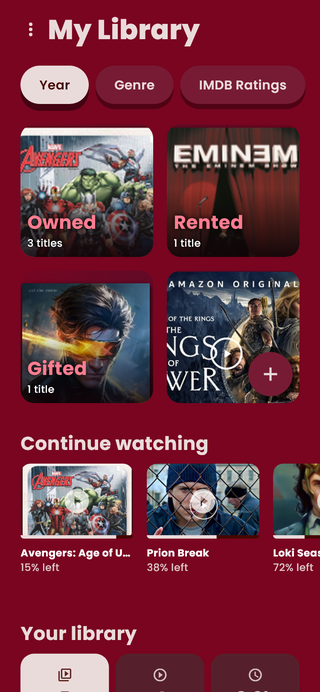 | 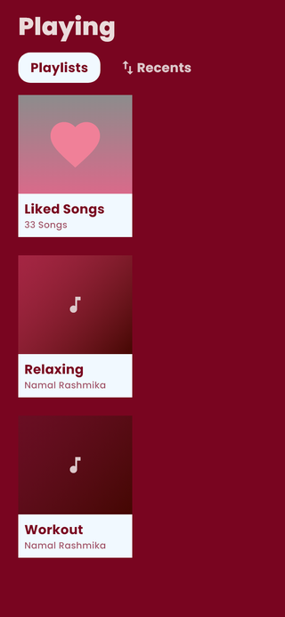 | 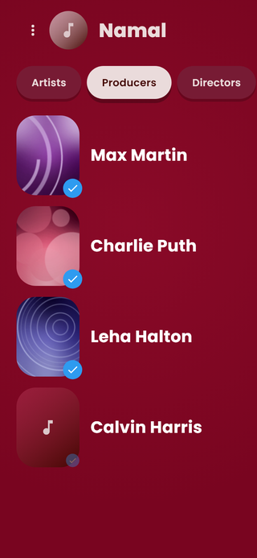 | 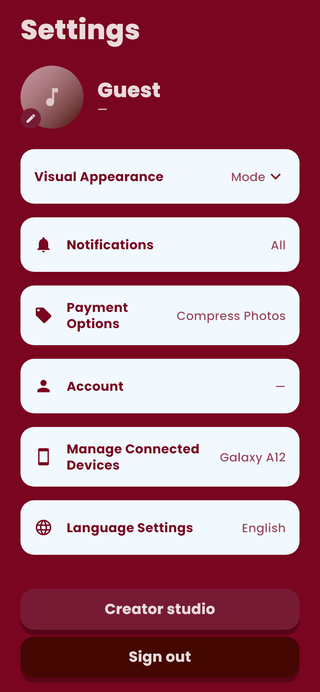 |

### Creator

| Studio | Analytics | My videos | Design system |
|:--:|:--:|:--:|:--:|
| 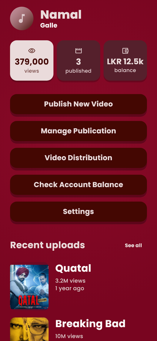 | 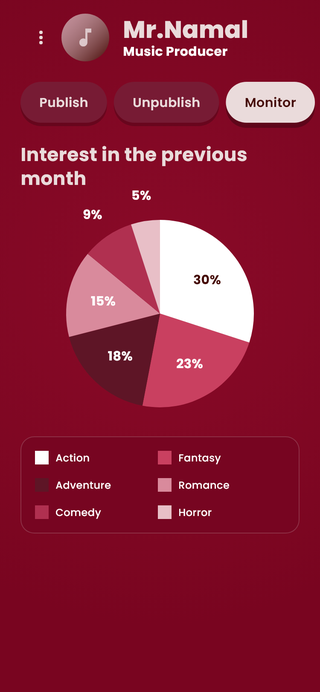 | 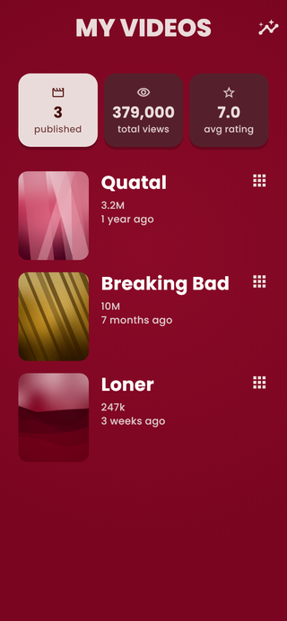 | 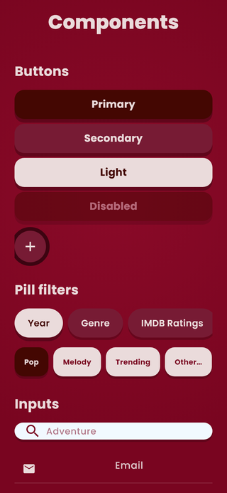 |

> The last tile is the built-in component gallery at route `/gallery` — every
> shared widget in its real states, so visual drift is easy to spot.

## Running

```bash
flutter pub get
flutter run
```

Web build:

```bash
flutter build web --release
```

## Android APK

```bash
flutter build apk --release
```

Produces a universal APK (~56MB, arm64-v8a + armeabi-v7a + x86_64). For
smaller per-device downloads use `--split-per-abi`.

Release builds are signed with the debug key — fine for sideloading, not
valid for the Play Store. Add a release keystore before publishing.

> This project pins `path_provider_android` to 2.2.17. Version 2.3.x pulls in
> `package:jni`, which forces the Android NDK toolchain even though nothing
> here compiles native code — a ~2.5GB install for no benefit.

## Deploying to the web

Flutter compiles to static files, so the app hosts anywhere that serves a
folder. This repo is configured for Vercel:

```bash
npm i -g vercel
vercel        # preview
vercel --prod # live
```

`vercel.json` points at `scripts/vercel-build.sh`, which fetches the Flutter
SDK on the build machine and runs `flutter build web --release`.

The web build uses clean paths (`/home`) rather than hash URLs (`/#/home`),
so the host must rewrite unknown paths to `index.html` — `vercel.json` does
this. Vercel checks the filesystem before applying rewrites, so real assets
still serve normally. Any other static host needs the same SPA fallback.

Any static host works the same way — push `build/web` to Netlify, Firebase
Hosting, GitHub Pages or Cloudflare Pages.

## Tests

```bash
flutter test
```

| Suite | What it guards |
|---|---|
| `screens_golden_test.dart` | Renders all 26 screens offscreen and diffs against reference images |
| `behaviour_test.dart` | Ownership, search, publishing, following, session state |
| `accessibility_test.dart` | Tap-target size, text contrast, screen-reader labels |

Goldens in `test/goldens/` double as a visual record of every screen. Refresh
after intentional UI changes:

```bash
flutter test --update-goldens
```

## Architecture

```
lib/
├─ core/
│  ├─ theme/     tokens: colors, typography, spacing, radii, shadows
│  ├─ router/    go_router route table
│  └─ widgets/   shared component library (+ /gallery reference screen)
├─ features/
│  ├─ onboarding/  splash, carousel, role picker, interests
│  ├─ auth/        sign in, sign up
│  ├─ discovery/   home, search, detail, player
│  ├─ library/     owned / rented / gifted
│  ├─ music/       playlists, now playing, playback controller
│  ├─ creator/     studio, publish, analytics, balance
│  ├─ people/      artists, producers, directors
│  └─ settings/
└─ data/
   ├─ models/    domain types
   ├─ mock/      stand-in catalogue
   ├─ repository.dart
   └─ session.dart
```

**State**: Riverpod · **Navigation**: go_router · **Charts**: fl_chart

## Design decisions

Three deliberate deviations from the source mockups:

1. **Contrast** — faded list titles in the designs failed WCAG AA. Raised to
   `#DCC7CA`, which holds 6.06:1 against the lightest point of the background
   gradient while keeping the muted look.
2. **Row heights** — the original screens clipped a third meta line. Rows are
   now content-sized.
3. **Touch targets** — several controls sat below the 48dp Android minimum and
   were raised to meet it.

All three are enforced by `accessibility_test.dart` rather than left as prose.

## Placeholder content and licensing

> **Not for distribution.** This is a portfolio prototype. The artwork, titles,
> and photographs shown are placeholders taken from the original design
> mockups. They are **copyrighted by their respective owners**, are used here
> only to demonstrate layout, and are **not licensed for redistribution or
> commercial use**. No affiliation with or endorsement by any rights holder is
> implied or claimed.

Swap `EvcArtwork`'s sources and `MockData` before any public release. Demo
audio is royalty-free (SoundHelix); demo video is Big Buck Bunny (Blender
Foundation, CC-BY).

## Status

Prototype. No backend, no payments — mock data behind a repository interface.
